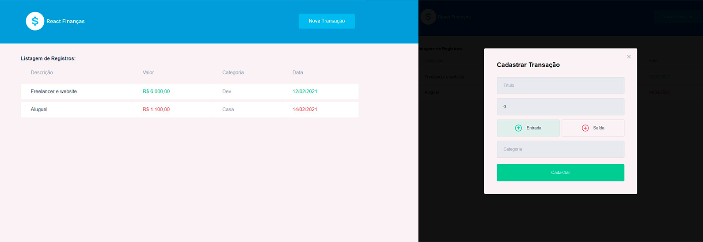

<h2  align="center">

</h2>

<p  align="center">
<a  href="#-projeto">Projeto</a>&nbsp;&nbsp;&nbsp;|&nbsp;&nbsp;&nbsp;
<a  href="#-tecnologias">Tecnologias</a>&nbsp;&nbsp;&nbsp;|&nbsp;&nbsp;&nbsp;
<a  href="#-orientações">Orientações</a>&nbsp;&nbsp;&nbsp;|&nbsp;&nbsp;&nbsp;
<a  href="#desafios-solucoes">Desafios e Soluções</a>&nbsp;&nbsp;&nbsp;|&nbsp;&nbsp;&nbsp;
<a  href="#-licença">Licença</a>
</p>

## 💻 Projeto

Este projeto é uma aplicação ReactJS desafio para listagem de dados em endpoint, formatacao e contextos;
Inspirado em um projeto das trilhas da [Rocketseat](https://www.rocketseat.com.br/) e feito por <a  href="https://github.com/hog099"  target="_blank">Hudson Oliveira</a>.

## 🧪 Tecnologias

O projeto foi desenvolvido usando as seguintes tecnologias:

- [React](https://reactjs.org)

- [Styled-Components](https://styled-components.com)

- [Axios](https://axios-http.com)

- [MirageJS](https://miragejs.com)

## 📝 Orientações

O projeto possui integrado o mirageJS, então ao startar o mesmo, estará disponível os endpoints para utilização.

##### Listagem de Transações

```js

GET: {{baseurl}}/api/transactions

```

##### Salvar transação

```js

POST: {{baseurl}}/api/transactions
body:{
    title: string,
    amount: number,
    category: string
    type: string
}

```

## <h2 id="desafios-solucoes">#Desafios e Soluções</h2>

<br>

#### #01 Home `‘./src/pages/home’`

Implementar ações de mostrar e ocultar modal

#### Solução

Nas funções `handleOpenNewTransactionmodal` e `handleCloseNewTransactionmodal` foi configurado o estado para exibir ou fechar o modal.

```js
function handleOpenNewTransactionmodal() {
  // TO DO - Implementar a alteracao do state para mostrar modal
  return setIsNewTransactionModalOpen(true);
}

function handleCloseNewTransactionmodal() {
  // TO DO - Implementar a alteracao do state para ocultar modal
  return setIsNewTransactionModalOpen(false);
}
```

---

#### #02 Contexto `‘.src/contexts/useTransactions’`

Implementar captação de listagem dos registros e salvar no estado do contexto, utilizar requisição na api (mockup api do miragejs), conforme endpoint acima, pasta './src/services' ja possui o agente para requisição.

#### Solução

Foi implementado a requisição `GET`, onde a mesma recebe todos os dados do banco e armazena em `transactions`. Além disso, o estado `requestData` foi criado para reconhecer quando o a requisição `GET` deve ser usada novamente para atualizar a listagem de transições.

```js
const [transactions, setTransactions] = React.useState([]);
const [requestData, setRequestData] = React.useState(new Date());

React.useEffect(() => {
  // TO DO - Implemente aqui um get para quando carregar a tela, trazer a listagem de transacoes
  axios.get("/api/transactions").then(({ data }) => {
    setTransactions(data.transactions);
  });
}, [requestData]);
```

---

#### #03 Modal `‘./src/components/NewTransactionModal’`

Implementar ação do submit do formulário para cadastrar a operação, fechar modal após submit

#### Solução

Aqui é criado o `newTransaction` para receber os estados do modal que, em seguida, é passado para `createTransaction()` como atributo. Por fim é requerido o fechamento do modal e todos os estados são retornados aos seus valores originais.

```js
async function handleCreateNewTransaction(event) {
  // TO DO - Implementar o envio dos dados dos formulario para cadastro na listagem
  event.preventDefault();

  const newTransaction = {
    title: title,
    amount: amount,
    category: category,
    type: type,
  };
  createTransaction(newTransaction);

  onRequestClose();

  // Resetando os estados
  setTitle("");
  setAmount(0);
  setCategory("");
  setType("deposit");
}
```

---

#### #04 Contexto `‘.src/contexts/useTransactions’`

Implementar a criação da transação vinda do submit do form no modal, utilizar requisicao na api (mockup api do miragejs), conforme endpoint acima, pasta './src/services' já possui o agente para requisição.

#### Solução

A função `createTransaction()` recebe o que é passado através do `submit` do modal e armazena no banco usando a requisição `POST`. Terminada a requisição, é atualizado o estado de `requestData`, fazendo com que a listagem seja atualizada na tela com a nova transação recém criada.

Porém, no modelo visto em <a  href="#-orientações">Orientações</a> não existe o atributo `createdAt`, então seguindo o modelo, todo item novo criado a partir do modal é apresentado na tela sem data.

```js
async function createTransaction(transactionInput) {
  // TO DO - Implemente aqui o post para salvar transacao, endpoint POST /transactions
  const transaction = {
    title: transactionInput.title,
    amount: transactionInput.amount,
    category: transactionInput.category,
    type: transactionInput.type,
  };

  axios.post("/api/transactions", transaction).then(() => {
    setRequestData(new Date());
  });
}
```

---

#### #05 Componente de listagem `‘./src/components/ListRegisters’`

Formatar valor e data, colocar coluna de valor e data nas cores verde ou vermelhor conforme tipo de operação, observar a classe do `<td/>` e ajustar no css.

#### Solução

Para definir as cores de acordo com o tipo de transação, foi necessário apenas definir a cor através do `CSS` usando as variáveis globais já definidas em `'./src/styles/globalStyles.js'`

```css
&.deposit {
  /* TO DO - Implementar cor para entrada conforme variaveis de cores do css */
  color: var(--green);
}

&.withdraw {
  /* TO DO - Implementar cor para saida conforme variaveis de cores do css */
  color: var(--red);
}
```

Para a formatação do dinheiro foi usado o `Intl.NumberFormat()` definindo a localização para o Brasil, especificando também a moeda brasileira. Para a data foi usado o `Intl.DateTimeFormat()` também especificando a localização para o Brasil.

```js
{transactions.map(transaction => {
  var amount = new Intl.NumberFormat('pt-BR', { style: 'currency', currency: 'BRL' }).format(transaction.amount);

  if(transaction.createdAt != null ){
    var date = new Intl.DateTimeFormat('pt-BR').format(new Date(transaction.createdAt));
  }

  return (
    <tr key={transaction.id}>
      <td>{transaction.title}</td>
      <td className={transaction.type}>
        {amount}
      </td>
      <td>{transaction.category}</td>
      <td className={transaction.type}>
        {date}
      </td>
    </tr>
  );
}
```

Foi necessário criar uma condição onde o `createdAt` não fosse nulo, pois não é possível fazer a formatação com o valor nulo.

Uma alternativa, que não foi colocada no codigo do desafio, é criar um complemento na condição para que o valor nulo seja substituído pela data atual.

```js
if (transaction.createdAt != null) {
  var date = new Date(transaction.createdAt);
  date = new Intl.DateTimeFormat("pt-BR").format(date);
} else {
  var date = new Intl.DateTimeFormat("pt-BR").format(Date.now());
}
```

## 📝 Licença

This project is licensed under the MIT License. See the [LICENSE](LICENSE.md) file for details.

---
